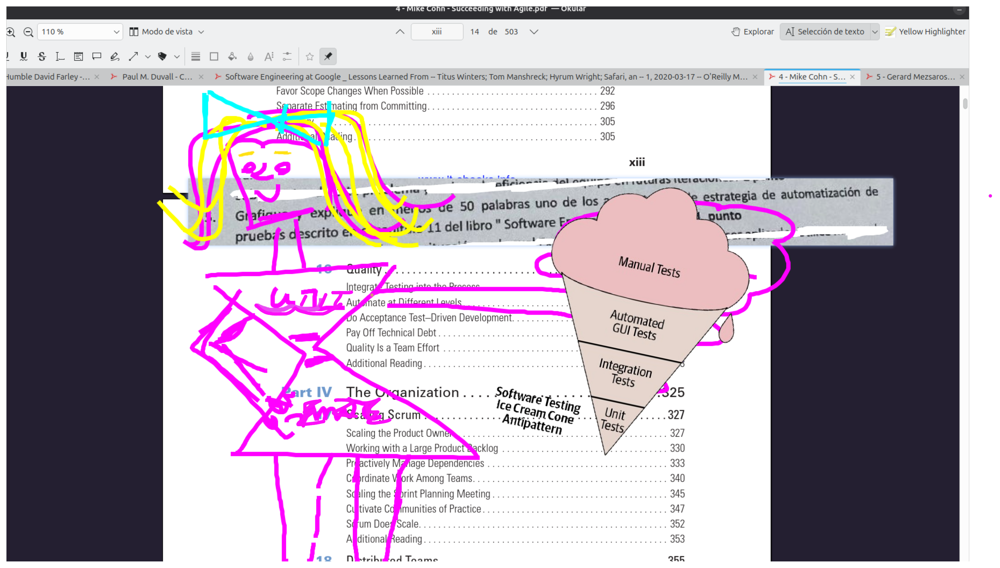

# **Tipos de *test doubles* (sustitutos de objetos reales) explicados en palabras simples**

\begin{table}[H]
\centering
\begin{tabularx}{\textwidth}{>{\bfseries}l|X|X|X}
\textbf{Tipo} & \textbf{Para qué se usa} & \textbf{Qué hace} & \textbf{Ejemplo rápido} \\
\hline
1. Test Stub & \textit{Dar datos pre-programados} a la unidad bajo prueba. & Responde a llamadas devolviendo valores fijos; \textbf{no guarda} lo que recibió. & Un \texttt{EmailServiceStub} cuya función \texttt{send()} siempre devuelve \texttt{true}, sin enviar nada. \\
\hline
2. Test Spy & \textit{Registrar lo que ocurre} para poder afirmar que pasó. & Hace lo mismo que un Stub \textbf{y además} guarda información sobre las llamadas (cuántas veces, con qué parámetros). & Un \texttt{PaymentGatewaySpy} que anota los montos cobrados para luego afirmar \texttt{wasCalledWith(100 €)}. \\
\hline
3. Mock Object & \textit{Verificar interacción} en tiempo real. & Tiene expectativas predefinidas (“debe llamarse una vez con X”) y falla el test si no se cumplen. Automatiza lo que haría un Spy + asserts. & Un mock de \texttt{Logger} configurado para esperar \texttt{log("ERROR")} exactamente una vez; si se llama dos o cero veces, el test falla. \\
\hline
4. Fake Object & \textit{Reemplazo liviano} de un componente costoso o externo. & Implementa una versión simplificada pero funcional de algo real (p. ej., base en memoria). Sirve para tests más realistas que con stubs/mocks. & Un \texttt{InMemoryDatabaseFake} que guarda datos en un \texttt{HashMap} en lugar de usar SQL. \\
\end{tabularx}
\caption{Tipos de \textit{test doubles} (sustitutos de objetos reales) explicados en palabras simples}
\end{table}

# **En resumen**

* **Stub**: solo *devuelve* datos.
* **Spy**: *devuelve* datos **y registra** llamadas.
* **Mock**: define **expectativas** de llamadas y las hace cumplir automáticamente.
* **Fake**: versión **funcional simplificada** de un componente real.

# Relación de los tests doubles con la pirámide de pruebas

\begin{table}[H]
\centering
\begin{tabularx}{\textwidth}{>{\bfseries}l|X|X|X}
\textbf{Tipo de prueba} & \textbf{¿Se suelen usar test doubles?} & \textbf{¿Por qué / para qué?} & \textbf{Ejemplo típico} \\
\hline
Unitarias & \textbf{Mucho} (stubs, mocks, spies, fakes) & Queremos probar una sola clase o función sin depender de red, disco, bases externas, etc. & Mock del servicio de correo para que \texttt{UserService} se testee sin enviar mails reales. \\
\hline
Integración & \textbf{A veces} & Se integran varios componentes reales, pero se sustituyen los que están \textit{fuera} del alcance (p. ej., proveedores externos, pasarelas de pago). & Fake de base de datos en memoria mientras se prueba la API real ←→ lógica de negocio real. \\
\hline
End-to-End (E2E) & \textbf{Rara vez} (solo si algún sistema externo es incontrolable o costoso) & El objetivo es cubrir la ruta completa “usuario ←→ producción”; cuantos menos dobles, mejor. & Stub de servicio de terceros que cobra por llamada, para no generar costes durante la ejecución nocturna de E2E. \\
\end{tabularx}
\caption{¿Cuándo se usan \textit{test doubles} según el tipo de prueba?}
\end{table}

Los test doubles se usan para aislar la parte del sistema que estamos ejercitando; cuanta más aislada es la prueba, más probabilidad hay de que aparezcan.

## Regla práctica

* A menor ámbito de la prueba → más test doubles para aislar y hacer los tests rápidos, repetibles y deterministas.
* A mayor ámbito (E2E) → menos test doubles para reflejar la realidad lo más fielmente posible.

# Relación entre criterios de diseño de pruebas y la pirámide de pruebas

Las pruebas de **caja negra** y **caja blanca** son **criterios de diseño de pruebas** que se aplican transversalmente a todos los niveles de la pirámide de pruebas (unitarias, integración, E2E). Aquí te explico su relación:

## Explicación detallada:

1. **Pruebas de Caja Negra**  
   - **Definición:** Se centran en **entradas y salidas** sin conocer la implementación interna.  
   - **Se aplica en:**  
     - Unitarias: Probar una función solo con inputs/outputs (ej: `sum(2,3) debe dar 5`)  
     - Integración: Validar comportamiento de API sin ver código  
     - E2E: Simular interacciones de usuario en interfaz  

   *Ejemplo en E2E:*  
   ```gherkin
   Scenario: Login exitoso
     When Ingreso usuario "test@mail.com"
     And Ingreso contraseña "Pass123"
     And Hago clic en "Iniciar sesión"
     Then Debo ver el dashboard
   ```

2. **Pruebas de Caja Blanca**  
   - **Definición:** Examinan la **estructura interna**, caminos de código y lógica.  
   - **Se aplica en:**  
     - Unitarias: Cubrir todas las ramas de un `if/else`  
     - Integración: Verificar flujo entre componentes  
     - Menos común en E2E (por el alto costo)  

   *Ejemplo en unitarias:*  
   ```python
   def test_discount_logic():
       # Prueba camino: precio > 100 y cliente premium
       assert apply_discount(150, is_premium=True) == 120  # Verifica lógica interna
   ```

## Tabla comparativa en contexto de pirámide:

| Nivel         | Caja Negra                          | Caja Blanca                         |
|---------------|-------------------------------------|-------------------------------------|
| **Unitarias** | 30-40% (validación funcional)      | **60-70%** (cobertura de caminos)  |
| **Integración** | **70%** (comportamiento observable) | 30% (flujos críticos)              |
| **E2E**       | **95%+** (experiencia de usuario)   | ~5% (solo casos técnicos críticos) |

## Combinación práctica:

- **Escenario típico en API**:
	- *Caja negra*: Validar status HTTP 200
	- *Caja blanca*: Verificar log interno de errores

- **En desarrollo ágil:**  
  - *Sprint planning:* Diseñar pruebas de caja negra para requerimientos  
  - *Development:* Implementar pruebas de caja blanca para cobertura  

## Conclusión clave:  

**Son dimensiones complementarias:**  

- La **pirámide** define el *alcance* (qué partes del sistema pruebo)  
- **Caja negra/blanca** define el *enfoque* (cómo diseño los casos de prueba)  

# Antipatrones de distribución de pruebas

## Antipatrón “Ice Cream Cone”

En este esquema la mayoría de los tests del proyecto son pruebas end-to-end (E2E) o de interfaz gráfica, con unas pocas de integración y casi ninguna prueba unitaria.
*Consecuencias:*

* la suite se vuelve muy lenta, porque las E2E tardan minutos u horas en correr;
* las fallas son frágiles y difíciles de diagnosticar, ya que un error en la capa superior no indica en qué módulo interno está el bug;
* los desarrolladores reciben retroalimentación tardía y pierden confianza en el conjunto de pruebas.

*Cómo corregirlo:* identificar flujos redundantes en la parte E2E y trasladarlos a pruebas unitarias o de servicio; emplear dobles de prueba para aislar dependencias; establecer métricas de cobertura y “presupuesto” de E2E para que la base unitaria crezca y la cima de la pirámide se reduzca.

---

## Antipatrón “Hourglass” (reloj de arena)

Aquí se acumulan muchas pruebas unitarias rápidas en la base y también bastantes E2E en la parte superior, pero casi no existen pruebas intermedias de servicio o integración.

*Consecuencias:*

* los contratos entre componentes quedan sin verificar de forma específica;
* los fallos en la interacción entre módulos aparecen tarde, detectados recién por las E2E, lo que encarece su corrección;
* parte del esfuerzo está duplicado: la lógica se prueba dos veces (unidad y E2E) mientras que las interfaces reales apenas se prueban.

*Cómo corregirlo:* añadir pruebas de servicio que ejecuten la API real entre dos componentes (con bases de datos o servicios externos sustituidos por fakes si es necesario); reducir la cantidad de E2E a los recorridos críticos; promover contract tests para validar acuerdos de datos y formatos entre equipos.

---

## Forma recomendada

Google propone una pirámide equilibrada: amplia base de pruebas unitarias rápidas y deterministas, una capa media suficiente de pruebas de servicio o integración ligera que ejerciten contratos entre módulos, y una cúspide delgada de E2E que cubra solamente los flujos más valiosos para el usuario final. Mantener esta proporción evita tanto la lentitud y fragilidad del “Ice Cream Cone” como los agujeros de cobertura del “Hourglass”.


